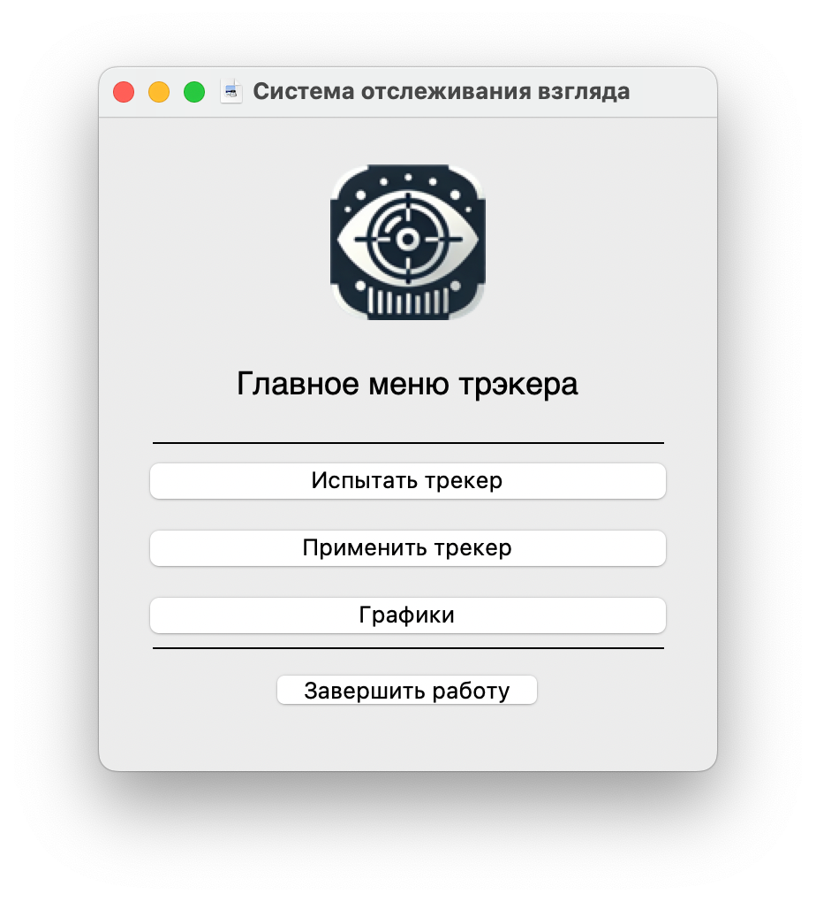
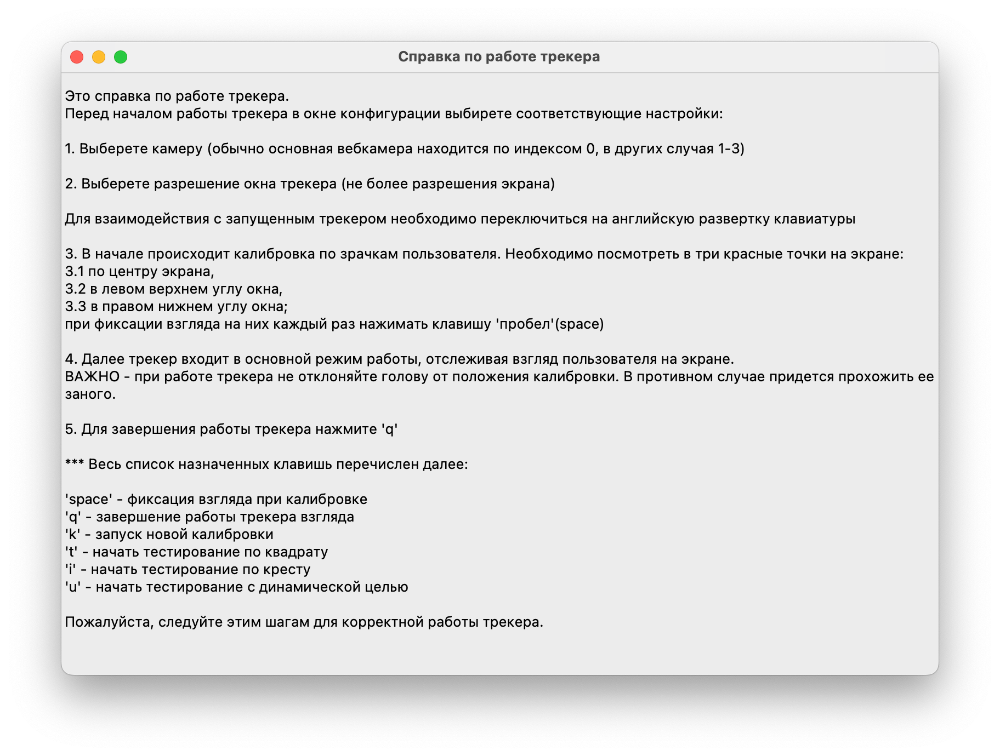
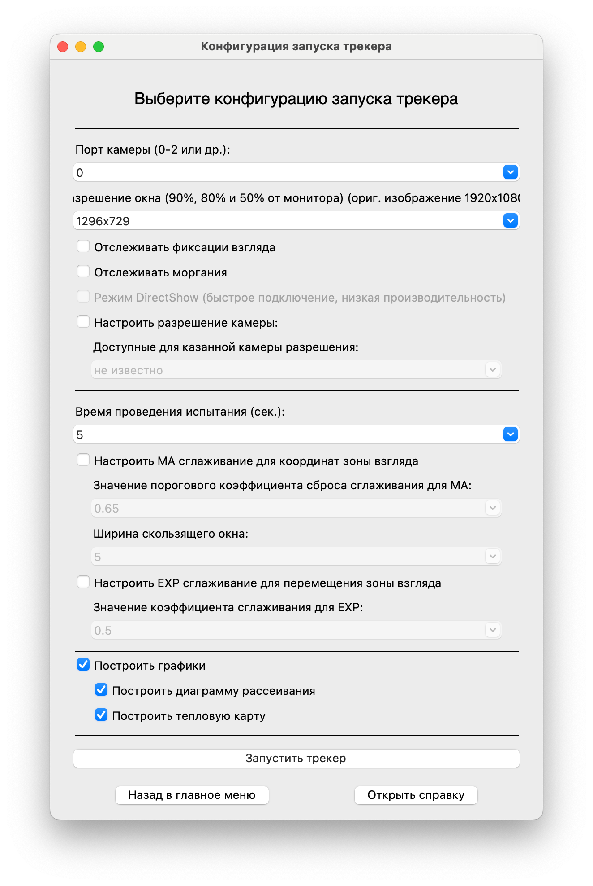
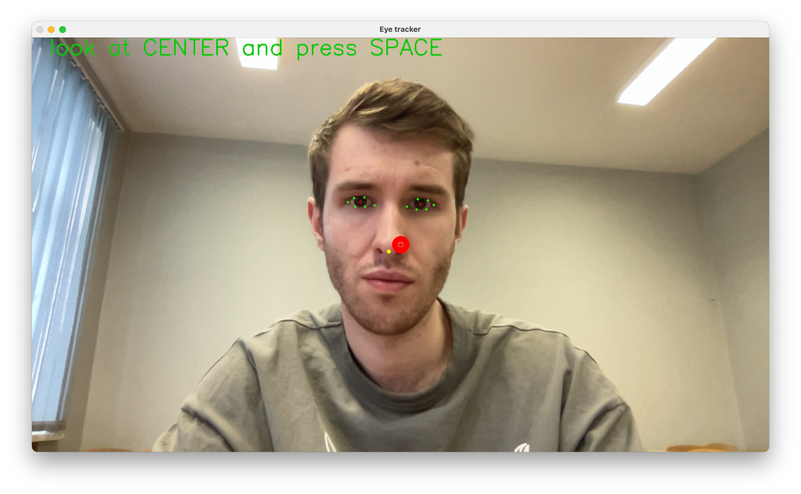
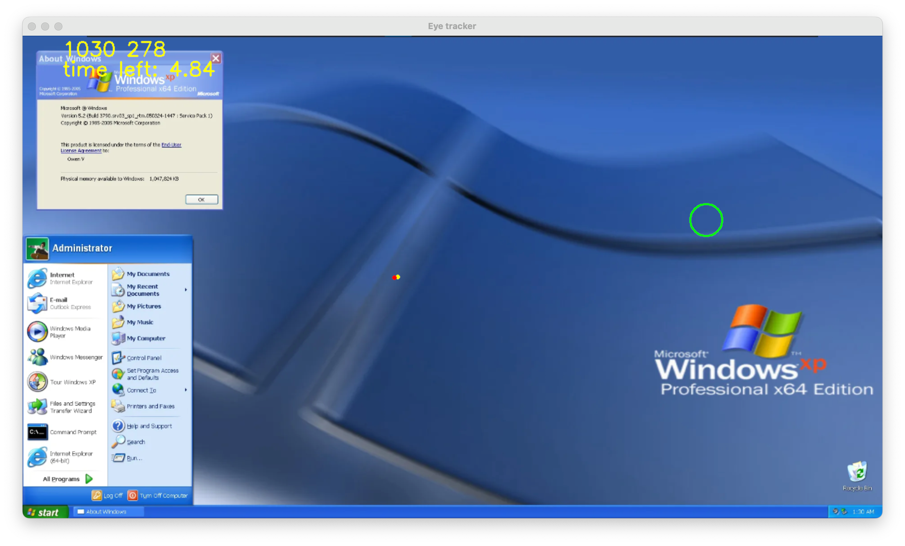
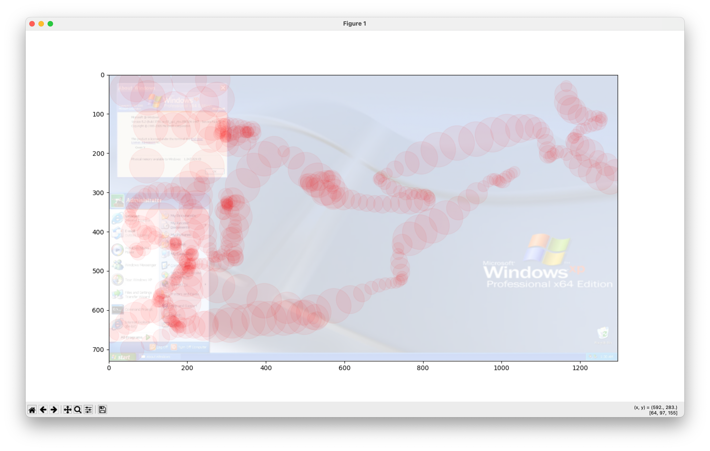
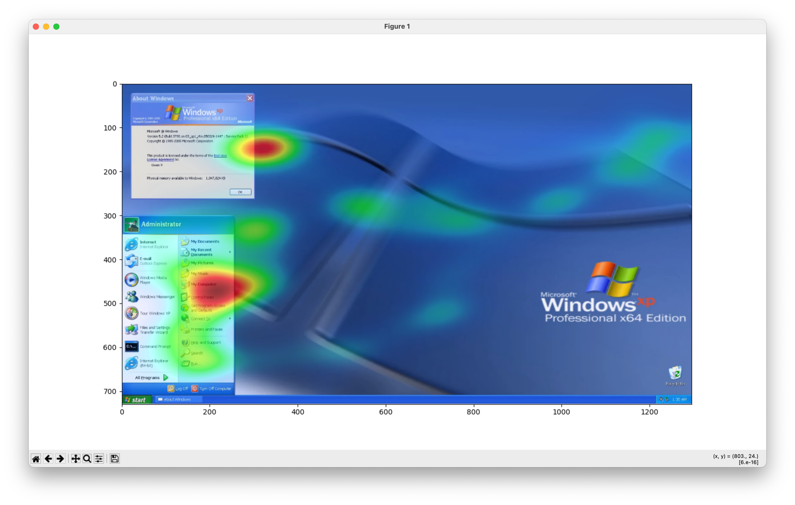
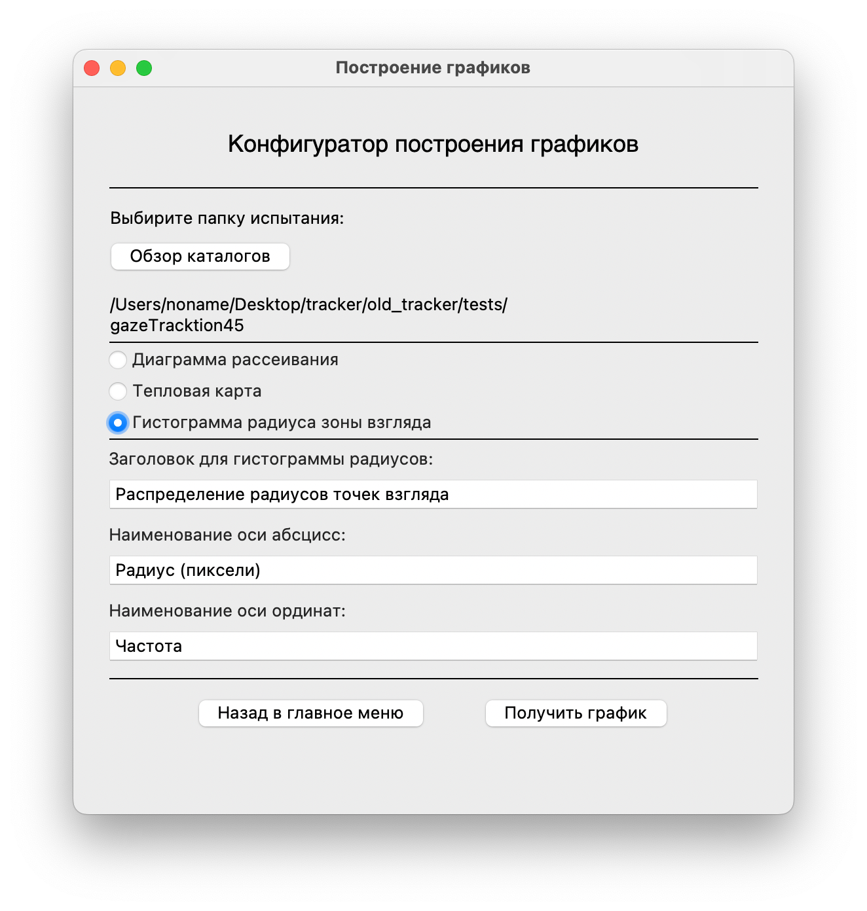
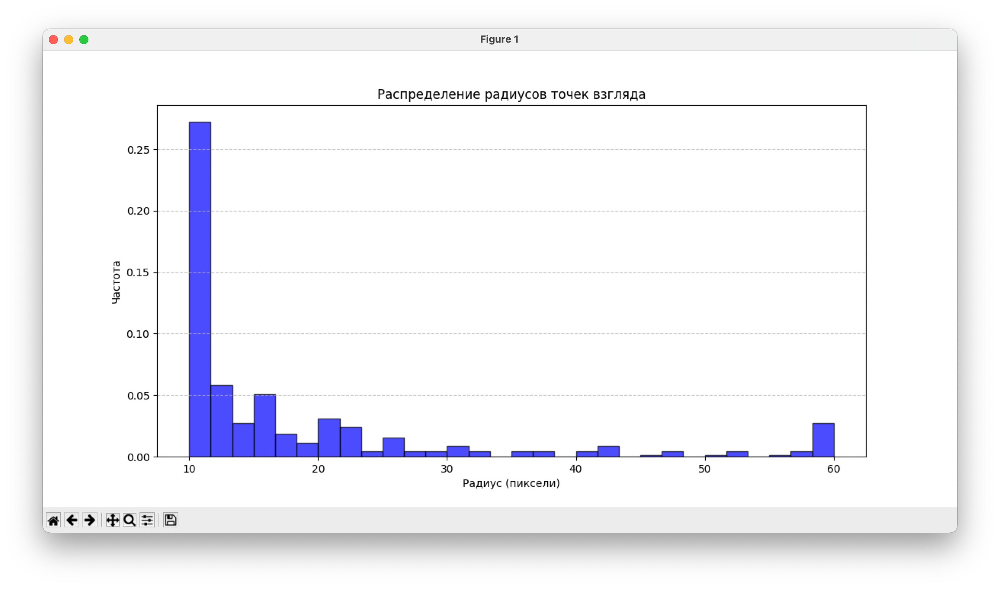

# 🎯 Приложение для отслеживания взгляда

*Функциональное десктопное приложение для сбора данных движения взгляда пользователя при изучении графиеских изображений*

## 🚀 Описание
Gaze Tracker App — это функциональный инструмент, предназначенный для отслеживания и последующего анализа движений глаз пользователя. Оно подходит для различных исследований, таких как изучение нюансов конгитивного восприятия, изучения акцентов внимания и других задач, связанных с отслеживанием взгляда.

## 🌟 Возможности
- 🔍 **Отслеживание взгляда в реальном времени**
- 📊 **Визуализация данных с графиками**
- 🖥️ **Тривиальный интерфейс**
- 💾 **Запись данных сеансов испытаний**
- ⚡ **Высокая производительность**

## 🛠 Установка
1. Клонируйте репозиторий:
   ```sh
   git clone https://github.com/your-username/gaze-tracker-app.git
   ```
2. Перейдите в папку с проектом:
   ```sh
   cd gaze-tracker-app
   ```
3. Создайте и активируйте виртуальное окружение:
   ```sh
   python -m venv venv
   source venv/bin/activate  # Для Windows: venv\Scripts\activate
   ```
4. Установите зависимости:
   ```sh
   pip install -r requirements.txt
   ```

## 🚀 Запуск приложения
Запустите скрипты приложения интерпретатором Python следующей командой командой:
```sh
python app.py
```

### 🔧 Компиляция в исполняемый файл (stand-alone *.exe)
Вы также можете скомпилировать приложение в исполняемый файл, который будет работать автономно, независимо от расположения исполняемого файла. Команда компеляции преведена далее:
```sh
pyinstaller --onefile --windowed \
  --hidden-import=mediapipe \
  --hidden-import=mediapipe.python.solutions.face_mesh \
  --add-data "venv/Lib/site-packages/mediapipe/modules/face_landmark/face_landmark_front_cpu.binarypb;mediapipe/modules/face_landmark" \
  --add-data "venv/Lib/site-packages/mediapipe/modules/face_landmark/face_landmark_with_attention.tflite;mediapipe/modules/face_landmark" \
  --add-data "venv/Lib/site-packages/mediapipe/modules/face_detection/face_detection_short_range.tflite;mediapipe/modules/face_detection" \
  --icon="icon.ico" app.py
```
**ВАЖНО!** Для успешной компеляции приложения замените пути, указанные в команде выше, до актуальных файлов моделей модуля Mediapipe. Собранное приложения без данных файллов работать не будет. 

После выполнения этой команды в папке `dist/` появится исполняемый файл `app.exe`.

## 📸 Скриншоты

Главное меню приложения             |  Меню выбора файла для исследования 
:-------------------------:|:-------------------------:
  |  

Справка по работе прилоежения  |  Окно конфигурации запуска трекера 
:-------------------------:|:-------------------------:
  |  

Калибровка работы трекера  |  Проведения испытания  
:-------------------------:|:-------------------------:
  |  

Диаграмма рассеивания взгляда  |  Проведения испытания  
:-------------------------:|:-------------------------:
  |  

Окно конфигурации построения грациков  |  Пример дополнительного графика  
:-------------------------:|:-------------------------:
  |  


## 🤝 Вклад в проект
Буду рад новым идеям и предложениям! Открывайте issues и отправляйте pull requests.

## 📜 Лицензия
Этот проект распространяется под лицензией [MIT License](LICENSE).

## 📬 Контакты
По вопросам пишите на [savelevvaa@mail.ru](mailto:savelevvaa@mail.ru) или создавайте issue.

